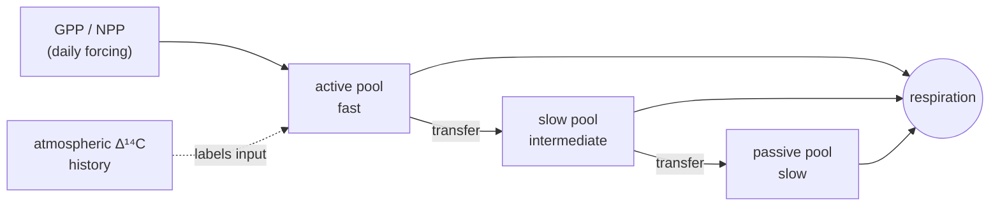
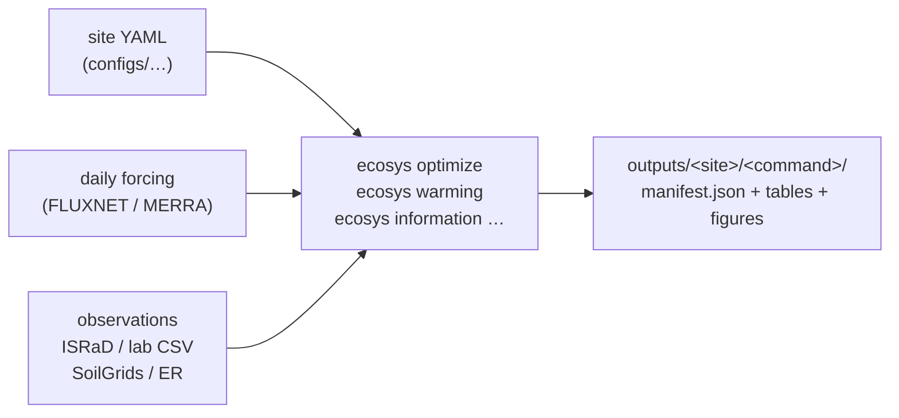

# ecosystem-complexity

`ecosystem-complexity` is a research model for asking a practical soil-carbon
question: when we combine carbon-flux measurements with radiocarbon, what can
we learn about how quickly carbon moves through soil?

The model follows ordinary carbon (¹²C) and radiocarbon (¹⁴C) through the same
set of pools. You can fit a site to observations and compare how much each kind
of measurement narrows the uncertainty. Each analysis is described by a
plain-text configuration file (YAML), which records the model structure and
scientific assumptions behind a run.

This is research code. Begin with one of the included site configurations
before adapting the model to a new site.

## The idea in one picture

Plant carbon enters soil, gets partitioned into a few kinetic pools, and leaves
as respiration. The same pipes carry ¹²C and ¹⁴C; the ¹⁴C label decays and
inherits its atmospheric history, so radiocarbon dates the carbon that fluxes
alone cannot separate.



Each pool has a turnover time (τ). Fitting a site means choosing the τ's — and a
few transfer fractions — so the modeled pool stocks, respiration, and Δ¹⁴C are
consistent with the measurements you have.

## Who this is for

- **Ecosystem modellers.** Start with [the model guide](docs/TECHSPEC.md) for
  the state variables, forcing, and diagnostics. Then follow the
  [Harvard Forest walkthrough](docs/apps/harvard-forest-example.md) end-to-end.
- **Lab and field scientists.** Read
  [Mapping soil fractions to model pools](docs/apps/soil-fraction-mapping.md)
  and [Custom data and constraints](docs/custom-data-and-constraints.md) —
  they explain what a density fraction, a bulk Δ¹⁴C profile, or a respired-CO₂
  Δ¹⁴C series actually constrains, and how to bring your own measurements in.
- **Anyone just running commands.** Use the [app guide](docs/apps/README.md).

## What you can do here

- Fit a site while accounting for measurements and prior knowledge.
- Compare the information supplied by fluxes, soil-carbon stocks, and
  radiocarbon measurements.
- Explore standardized warming and transit-time experiments.
- Work with individual sites or the included multi-site collections.

## Install

Python 3.11 or newer is required. The conda environment includes the model and
development dependencies:

```bash
make env
conda activate ecosystem-complexity
make install
```

Or create a virtual environment and install the package with its development
tools:

```bash
python -m venv .venv
source .venv/bin/activate
pip install -e ".[dev]"
```

Check that the package and its dependencies import, then run the test suite:

```bash
python -c "import ecosystem_complexity, jax, optax; print('Ready')"
make test
```

If you need GPU support, install the appropriate JAX build for your platform
after creating the environment. The [JAX installation guide](https://docs.jax.dev/en/latest/installation.html)
has the current instructions.

## How a run is organized

Every workflow follows the same shape: a YAML config points at forcing and
observations, an `ecosys` command runs, and results land in one folder with a
`manifest.json` describing what was produced.



The [outputs guide](docs/apps/outputs.md) explains how to read what a run
writes.

## First run

The most approachable starting point is the Harvard Forest configuration. It
already names the site, its pools, observations, and input data location.

```bash
ecosys optimize configs/multisite/harvard_forest.yaml
```

That command fits the configured model to the available observations. For a
small, reproducible collection of sites, use the direct-warming site set:

```bash
ecosys optimize \
  --site-set configs/site_sets/direct_warming_network_24.yaml \
  --include-er -j 4
```

Once a fit is available, you can run a warming experiment for the same site
set:

```bash
ecosys warming \
  --site-set configs/site_sets/direct_warming_network_24.yaml \
  --include-er -j 4
```

To see which observations contribute most to the fitted parameters:

```bash
ecosys information shapley \
  --site-set configs/site_sets/direct_warming_network_24.yaml \
  --plot-by biome -j 4
```

Use `ecosys <command> --help` before a longer run. It gives the current list
of options for the workflow installed in your environment.

## Add a site

Configs under `configs/multisite/` are a good starting point for tower sites;
`configs/expansion/` contains additional sites and forcing arrangements. A
config records the site metadata, soil layers and pools, parameter priors,
observations, and forcing source.

To find a tower near an ISRaD site before creating a configuration:

```bash
ecosys config locate --flux-tower US-Ha1 --out /tmp/harvard_sites.csv
```

Then create a starting configuration and stage its tower data:

```bash
ecosys config build \
  --selector US-Ha1 --tower-id US-Ha1 \
  --lat 42.5378 --lon -72.1715 \
  --biome "temperate deciduous forest" \
  --out configs/multisite/my_site.yaml

ecosys fetch flux my_site --accept-policy --accept-license
```

Review the new configuration before fitting it. Downloading AmeriFlux data
requires your own credentials; provide them with `--user-id` and `--email`, or
put `AMERIFLUX_USER_ID` and `AMERIFLUX_EMAIL` in the repository-root `.env`.
See [`ecosys fetch`](docs/apps/fetch.md) for external sources, destinations,
access requirements, and failure handling.

### Run with your own laboratory ¹⁴C data

Use a CSV for measurements and a small YAML manifest for metadata and
fraction-to-pool mapping. Start by copying the tracked
[example manifest](examples/custom_14c/example_lab_14c.yaml) and
[example measurements](examples/custom_14c/example_lab_14c.csv) into a local
input folder such as `data/custom/`. The input format and required columns are
described in [the example README](examples/custom_14c/README.md).

Copy a working site configuration, retaining its model, inversion, and forcing
blocks. Update the site metadata and datasource block to point to your
meteorological forcing and laboratory manifest:

```yaml
datasource:
  forcing_glob: path-or-pattern-for-your-daily-forcing
  forcing_kind: daily
  radiocarbon_manifest: ../../data/custom/my_site_14c.yaml
```

`israd_name` is not needed with `radiocarbon_manifest`. The manifest overrides
the configured ISRaD observation path, so the CSV's bulk, fraction, and
respiration records are used automatically. A forcing file is still required:
it supplies the climate and GPP/NPP time series that drive the model.

Run the fit by passing the new configuration directly:

```bash
ecosys optimize configs/multisite/my_lab_site.yaml --outdir outputs/my_lab_site
```

Before a long fit, validate that the config, forcing, and lab-data mapping load
correctly:

```bash
ecosys model validate configs/multisite/my_lab_site.yaml
```

The run writes its configuration snapshot, fitted pool turnover times,
diagnostics, and raw posterior arrays under the selected output directory.
Start without `--include-er`, `--include-incubation`, or
`--include-incubation-14c`; add those only when you also have the corresponding
observations and want them to constrain the fit.

For the full input format, constraint choices, and examples of adding ER or
adjusting inversion assumptions, see [custom data and constraints](docs/custom-data-and-constraints.md).

## Common commands

| Command | When to use it |
|---|---|
| [`ecosys optimize`](docs/apps/optimize.md) | Fit one configuration, a site set, or a pool-structure sweep. |
| [`ecosys warming`](docs/apps/warming.md) | Run a standardized warming experiment from a site fit. |
| [`ecosys information shapley`](docs/apps/information.md) | Compare how observation types constrain parameters. |
| [`ecosys mcmc`](docs/apps/mcmc.md) | Draw posterior and prior uncertainty for cross-site analysis. |
| [`ecosys fetch`](docs/apps/fetch.md) | Download or extract forcing data. |
| [`ecosys config`](docs/apps/config.md) | Find sites and build configuration files. |
| [`ecosys analyze`](docs/apps/analyze.md) | Run network, transit-time, and summary analyses. |
| [`ecosys report`](docs/apps/report.md) | Combine results and produce cross-ecosystem summaries. |
| [`ecosys model`](docs/apps/model.md) | Validate site inputs or run a forward model simulation. |

Keep the exact config, command, input data version, and output tables together
for every result you interpret or share.

## Project map

```text
src/ecosystem_complexity/   model, inference, data handling, and analysis code
configs/                    example site configs and site-set manifests
data/                       local forcing and observation inputs (not all tracked)
notebooks/                  exploratory and paper-figure workflows
docs/                       scientific background and reference notes
tests/                      unit and integration tests
```

## Development

```bash
make lint
make format
make test
```

## License and contact

See [LICENSE](LICENSE). For questions about the research workflow, contact
Newton H. Nguyen at nnewton@stanford.edu.
