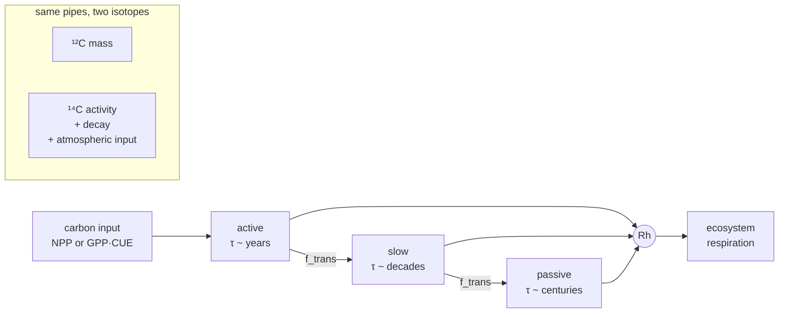
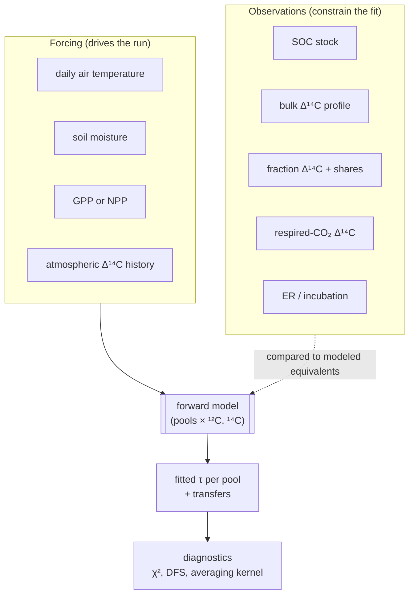

# How the ecosystem-complexity model works

A scientific guide to the model, aimed at readers new to soil-carbon or
radiocarbon modeling. It is not a substitute for the YAML that actually runs.
Start with [`configs/multisite/harvard_forest.yaml`](../configs/multisite/harvard_forest.yaml)
for a working example and [`configs/schema.yaml`](../configs/schema.yaml) for
the annotated configuration reference.

## The question, in plain language

The same soil respiration can come from a small, fast-cycling reservoir or a
large, slow-cycling reservoir. Fluxes alone cannot tell them apart. Radiocarbon
can, because its atmospheric history and radioactive decay carry information
about the *age* of the carbon leaving the soil.

The model asks: is there **one** consistent set of pool sizes, turnover times,
and transfers that explains **all** the measurements at a site? Available
observation families are:

- eddy-covariance carbon fluxes (GPP, ER, NEE)
- soil-carbon stocks (whole column)
- bulk Δ¹⁴C (whole-soil profiles)
- density-fraction Δ¹⁴C and fraction carbon shares
- respired-CO₂ Δ¹⁴C time series
- optional incubation-rate and incubation-Δ¹⁴C constraints

## The state variables

Each site has one or more **soil layers**. A layer contains named
**soil-organic-matter pools** — commonly `active`, `slow`, and `passive`. The
names are labels; behavior comes from turnover-time priors and transfer rules.



Each daily time step:

1. Carbon input arrives and is partitioned among pools.
2. Decomposition rates are adjusted for temperature (Q10), moisture, and thaw
   where relevant.
3. Mass leaves each pool: some transfers to a slower pool, the rest respires.
4. The same flows are applied to ¹²C and ¹⁴C. The ¹⁴C tracer also decays and,
   at input, inherits the atmospheric Δ¹⁴C for that year.

The model reports NEE, GPP, ecosystem respiration (ER), heterotrophic
respiration (Rh), pool stocks, and pool Δ¹⁴C.

## From measurements to model, and back



Every observation has a modeled equivalent — for example, a whole-soil bulk
Δ¹⁴C measurement is compared to a **carbon-mass-weighted mixture** of the
modeled pool Δ¹⁴C, not to any single pool. See
[Mapping soil fractions to model pools](apps/soil-fraction-mapping.md) for
what each measurement type actually constrains.

## Fitting a site

The primary fitting workflow uses Optimal Estimation. It finds parameter values that both agree with observations and remain plausible under the prior uncertainty stated in the config. A close fit is not automatically a well-constrained result: posterior uncertainty and the diagnostics show which parameters were genuinely informed by observations.

```bash
ecosys optimize configs/multisite/harvard_forest.yaml
```

Use `--observation-path` to compare a specified subset of measurements. Always record that choice with any result you intend to interpret or publish.

## Information diagnostics

These answer *which measurement matters for which parameter*, not just *did
the model fit*. All are local, linearized properties of the fitted solution.

| Diagnostic | Short intuition |
|---|---|
| **DFS** (degrees of freedom for signal) | How many independent parameter combinations the data actually resolve, from 0 (all prior) to the number of parameters. |
| **Averaging kernel** | For each fitted parameter, how much of it came from the data vs. the prior — diagonal near 1 means data-informed. |
| **Gain matrix** | How the fitted parameters would move if one observation changed by a unit. |
| **Shapley attribution** | Fair share of DFS assigned to each observation family (e.g. bulk vs. fraction ¹⁴C), averaged over inclusion orders. |

These depend on the assumed observation errors and parameter priors. Use them
to compare clearly stated scenarios, not as universal properties of a site.

## Warming and transit time

The warming workflow repeats the configured forcing with a uniform temperature perturbation and evaluates the selected response over the chosen horizon. It is a standardized sensitivity experiment, not a site-specific climate forecast.

Transit-time analyses summarize how long carbon remains in the modeled system. Intrinsic transit time reflects fitted turnover and transfers; realized transit time also reflects the environmental forcing used in the run. Treat both as model-based diagnostics, and report the pool structure and observation set behind them.

## Working with configs

The config is part of the scientific method for a run. Before editing one, make sure you can explain the selected layers and pools, the source and depth of each observation, the turnover-time priors, and the observations included in the fit.

For a new site, use `ecosys config locate` to find likely ISRaD–tower matches and `ecosys config build` to make a starting YAML. Review and adjust the resulting file before downloading data or fitting the site.

For sites with laboratory measurements outside ISRaD, see [custom data inputs
and fit constraints](custom-data-and-constraints.md). It explains the
CSV-plus-manifest input, source-specific constraint options, and validation
workflow.

## Reproducibility

Keep the exact site YAML, site-set YAML if used, command and options, input data versions, and output tables together. The repository includes exploratory notebooks and historical exports; a config plus an explicit `ecosys` command is the clearest starting point for a reproducible analysis.
