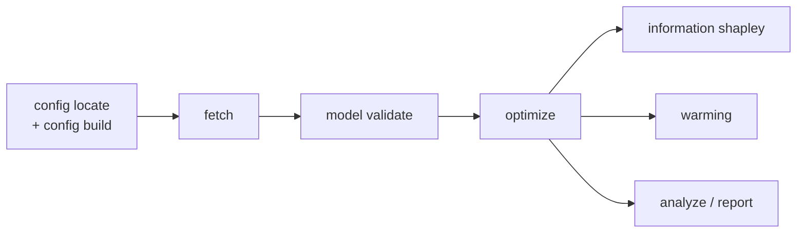

# `ecosys` command guide

`ecosys` is the command-line entry point for the repository's repeatable workflows. Give it a site config, a site-set manifest, or a group of configs where supported.

Start with [Reading `ecosys` outputs](outputs.md) when reading or reporting a
result. For a concrete example, see the [Harvard Forest walkthrough](harvard-forest-example.md).

## Typical workflow

Most users move through these commands in order. Each writes into its own
`outputs/` subfolder with a `manifest.json`.



- **Setup** (`config`, `fetch`, `model validate`) — put a site together and
  check its inputs load.
- **Fit** (`optimize`) — one site or a site set.
- **Interpret** (`information`) — how much did each observation family help?
- **Project** (`warming`) — standardized sensitivity, not a forecast.
- **Synthesize** (`analyze`, `report`) — cross-site tables and figures.

```bash
ecosys --help
ecosys <command> --help
ecosys <command> <subcommand> --help
```

The built-in help is the authoritative list of flags. A few commands still wrap research-oriented analysis modules, so their exact output location can depend on the selected config and options.

| Command | Purpose |
|---|---|
| [`optimize`](optimize.md) | Fit a site or a group of sites to observations. |
| [`warming`](warming.md) | Run a warming experiment from a fitted model. |
| [`information`](information.md) | Ask which observations constrain the parameters. |
| [`mcmc`](mcmc.md) | Propagate uncertainty for cross-site comparisons. |
| [`fetch`](fetch.md) | Download or extract forcing data. |
| [`config`](config.md) | Locate sites and write configs. |
| [`analyze`](analyze.md) | Run network, transit-time, and summary analysis. |
| [`report`](report.md) | Merge results and build cross-ecosystem summaries. |
| [`model`](model.md) | Validate a site input set or run the forward model. |
| [Schema reference](schema.md) | Understand the fields in a site configuration. |
| [Soil-fraction mapping](soil-fraction-mapping.md) | Map laboratory fractions to model pools carefully. |
