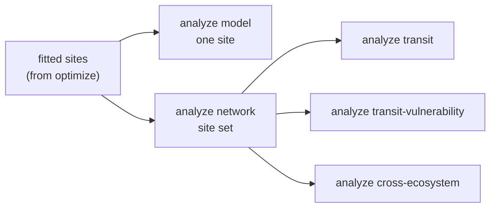

# `ecosys analyze`

`analyze` produces **new derived artifacts** from fitted sites — per-site
diagnostics, cross-site tables, transit-time calculations, and cross-ecosystem
summaries. It reads fitted parameters (either re-running the site inversion
or loading exported artifacts) and writes fresh outputs. Use it after
`ecosys optimize` has produced site fits.

For combining tables that already exist without recomputing anything, use
[`ecosys report`](report.md) instead.

## The five subcommands

| Subcommand | Scale | What it does | Read first |
|---|---|---|---|
| `model` | one site | Recomputes/loads a fitted site, then writes diagnostics, observation fit, Shapley attribution, and a diagnostic figure. | `summary.json`, `site_diagnostics.png` |
| `network` | site set | Runs the OE inversion for every site in the set, records the constraint ladder (¹²C → +bulk ¹⁴C → +fraction ¹⁴C → +respired ¹⁴C), and aggregates diagnostics across sites. | `aggregate_summary.json`, `site_summary.csv` |
| `transit` | site set | Computes mean transit time from fitted τ's and transfer topology. Three modes (see below). | `transit_times.csv` and figure |
| `transit-vulnerability` | site set | Leave-one-biome-out ridge regression to test whether transit-time features improve prediction of warming vulnerability across biomes. | LOBO summary CSV |
| `cross-ecosystem` | multiple sets | Combines site and warming summaries into a cross-ecosystem figure and Markdown report. | `report.md` |



All five write to `outputs/<name>/analyze/<subcommand>/` with a `manifest.json`
and `logs/run.log`. The app owns output locations — use `--outdir` and
`--name`, not a subcommand-specific `--out` / `--figure` / `--export-dir`.

## `analyze model` — one site, in detail

```bash
ecosys analyze model configs/multisite/harvard_forest.yaml \
  --name harvard_forest_example
```

Re-runs (or loads with `--from-artifacts`) the fit for one site and writes:

| File | What it contains |
|---|---|
| `summary.json` | Reduced χ², weighted RMSE, DFS total, convergence status. Read this first. |
| `observations.csv` | Every observation with its modeled equivalent, unit, and residual. |
| `constraint_ladder.csv` | DFS gained as each observation family is added (¹²C → +bulk → +fraction → +respired). |
| `shapley_by_observation.csv` | Shapley DFS attribution across observation families at the fitted point. |
| `ablation.csv` | Fit quality if each observation family is removed. |
| `fit_matrices.npz` | Jacobian, gain, and averaging kernel arrays. |
| `site_diagnostics.png` | Forcing / stock / respired-Δ¹⁴C / 1:1 / DFS panel. |

`model` describes the *stated* fit. It is not independent validation — the
observations used in the fit are the same ones plotted.

## `analyze network` — site set

```bash
ecosys analyze network \
  --site-set configs/site_sets/direct_warming_network_24.yaml \
  --include-er-constraint --workers 4
```

Loops over every config in the site set, runs the OE inversion, and collects
per-site diagnostics into one folder. Outputs:

| File | One row per | What it contains |
|---|---|---|
| `site_summary.csv` | site | Fitted `tau_<pool>_yr`, transfer fractions where retained, χ²/dof, DFS total, converged flag, constraint counts, biome group, forcing source. This is the canonical downstream table. |
| `ladder_summary.csv` | site × ladder rung | Cumulative DFS after each observation family is added. Shows *where* information came from at each site. |
| `shapley_summary.csv` | site × observation family | Shapley DFS attribution (bulk ¹⁴C vs. fraction ¹⁴C vs. respired ¹⁴C vs. ¹²C constraints…). |
| `failures.csv` | site (only failed) | Site id, reason, and traceback pointer for any site that did not converge or was skipped. |
| `aggregate_summary.json` | — | Counts (n sites attempted, converged, skipped), median χ², median DFS, elapsed wall time. |

Read `aggregate_summary.json` first to see how many sites converged, then
`failures.csv` to see which ones didn't and why, then `site_summary.csv` for
the numbers.

## `analyze transit` — how long carbon stays

Three modes, each with a distinct interpretation:

| Mode | Environment used | What it answers |
|---|---|---|
| `intrinsic` | reference (steady, no seasonality) | If forcing were held at reference, how long would a unit of C-input take to leave? Depends only on τ's and transfer topology. |
| `realized` | site's actual daily forcing, cycled | With this site's temperature, moisture, and GPP seasonality, how long does a unit of C-input take to leave? |
| `gradient` | site's forcing, with posterior draws | Same as `realized`, plus uncertainty from posterior draws around the MAP. |

```bash
ecosys analyze transit --mode intrinsic
ecosys analyze transit --mode realized
ecosys analyze transit --mode gradient
```

Each mode writes a CSV of per-site transit-time metrics and a matching PNG.
`gradient` additionally writes `gradient_transit_draws.csv` with the sampled
distribution. Transit time is a **model-based diagnostic**, not a direct
measurement — it reflects the pool structure and priors used to fit the site.

## `analyze transit-vulnerability` — does transit time predict warming response?

```bash
ecosys analyze transit-vulnerability \
  --site-set configs/site_sets/direct_warming_network_24.yaml
```

Trains a ridge regression to predict a warming-vulnerability target from
site-level features (with and without transit-time features included), then
tests it **leave-one-biome-out**: hold out every site in one biome, train on
the rest, predict the held-out biome, repeat. Judge the value added by a
feature by the held-out error, not in-sample fit. Outputs are the LOBO
prediction CSV, per-site metrics, and a summary of held-out skill by biome.

## `analyze cross-ecosystem` — final cross-site synthesis

```bash
ecosys analyze cross-ecosystem \
  --network-summary outputs/<set>/analyze/network/site_summary.csv \
  --warming-summary outputs/<set>/warming/network_warming_summary.csv
```

Joins the network and warming summaries with the biome grouping and writes a
Markdown report (`report.md`), the cross-ecosystem figure, and a CSV bundle
behind it. This is **descriptive synthesis**: the cross-site pattern it shows
is only as comparable as the input summaries. If the underlying sites were fit
with different observation mixes, priors, or forcings, that comparability must
be checked before making a claim from this figure.

## Harvard Forest example

```bash
ecosys analyze model configs/multisite/harvard_forest.yaml \
  --name harvard_forest_example
```

This single-site diagnostic is the fastest way to see fit quality and DFS
before running a network analysis. The example run reports about 2.82 DFS
across the 12-parameter state, so it would be too strong to claim every
fitted parameter is independently measured.


