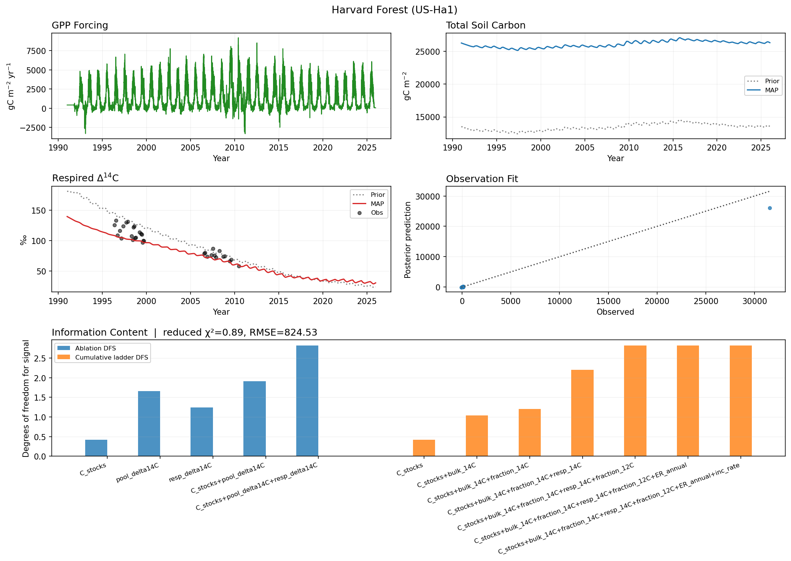

# `ecosys fetch`

Use `fetch` to stage the external inputs consumed by site workflows. Downloaded inputs live under `data/`; `outputs/` holds only fetch manifests.

# Examples

### Tower forcing: AmeriFlux or ICOS

```bash
# AmeriFlux uses the configured tower and credentials in .env.
ecosys fetch flux harvard_forest --accept-policy --accept-license
```

For an ICOS-configured site, the same command selects ICOS automatically; retain
`--accept-license` to acknowledge its licence.

### FLUXCOM-X forcing

```bash
ecosys fetch fluxcom configs/expansion/nahuelbuta.yaml
```

### CLM from a direct NetCDF URL

```bash

# Download selected CLM/CTSM or CMIP NetCDF files, then extract site series
ecosys fetch clm configs/my_clm_site.yaml --source-dir data/raw/clm \
  --url 'https://archive.example/model_history.nc'
```

### CLM5/CESM2 from Pangeo

```bash

# Extract CESM2 CLM5 series directly from public Pangeo CMIP6 Zarr stores
ecosys fetch clm configs/my_clm_site.yaml --pangeo \
  --pangeo-model CESM2 --pangeo-experiment historical \
  --pangeo-member r1i1p1f1 --pangeo-ssp ssp585
```

This fetches the historical record and the chosen SSP. Omit `--pangeo-ssp` for
historical only. Add `--pangeo-include-14c` only when the selected archive
publishes `c14Soil`.

### ISRaD and atmospheric radiocarbon

```bash

# Download official compiled ISRaD tables and atmospheric 14C records
ecosys fetch israd
ecosys fetch atm14c --hua-url 'https://…/Hua_2021.csv' \
  --graven-url 'https://…/Graven_2017.csv' --overwrite
```

`make install` runs these required-input fetchers automatically. The ISRaD and
IntCal20 sources have defaults; Hua and Graven remain unchanged unless their
direct publisher URLs are supplied.

| Subcommand | Source | Stored at |
|---|---|---|
| `flux` | AmeriFlux API or ICOS Carbon Portal | `data/<forcing_glob>` |
| `fluxcom` | [FLUXCOM-X 2021 ICOS objects](https://meta.icos-cp.eu/objects/KTbxZpEAqivQVKyNf9Ec8fCv) | `data/shared/fluxcom/` |
| `clm` | Local/direct NetCDFs, or public [Pangeo CMIP6](https://pangeo-data.github.io/pangeo-cmip6-cloud/accessing_data.html) Zarr stores | `--source-dir`, then `data/shared/clm/` |
| `israd` | Official [ISRaD compiled database](https://international-soil-radiocarbon-database.github.io/ISRaD/rpackage/) archive | `data/shared/israd/` |
| `atm14c` | Hua et al. (2021), Graven et al. (2017), and [IntCal20](https://intcal.org/curves/intcal20.14c) | `data/shared/atm_14C/` |

ISRaD download validates the four exact versioned tables expected by this checkout before replacing them. `atm14c` retrieves IntCal20 by default when missing; supply direct CSV URLs for Hua and Graven, whose publishers distribute the supplemental records separately. `fetch clm --pangeo` searches the public Pangeo CMIP6 catalog and reads only the nearest site cell from each Zarr store. It downloads the CESM2 CLM5 soil pools (`cSoilFast`, `cSoilMedium`, `cSoilSlow`, total soil carbon, and litter), GPP/NPP inputs, and heterotrophic respiration by default. Historical data are retrieved by default; use `--pangeo-ssp ssp245` or `--pangeo-ssp ssp585` for projections. Each site/experiment is stored as a compact `*_pangeo.nc` archive, while historical GPP/Rh also produce the normal forcing/ER CSVs. Fluxes are converted from CMIP6 `kg C m⁻² s⁻¹` to `g C m⁻² day⁻¹`. Use `--pangeo-include-14c` to request `c14Soil`; CESM2's public CMIP6 Pangeo collection currently does not provide that variable, so the command fails without writing an incomplete archive.

`make install` runs `make download-data`, which invokes the ISRaD and atmospheric-14C fetchers. Existing datasets are left untouched. The current atmospheric Hua and Graven CSVs remain project-staged inputs because their publishers distribute supplemental records separately; provide `--hua-url` and `--graven-url` to refresh them.

Put AmeriFlux identifiers in the repository-root `.env` (ignored by Git), or pass them for one command:

```dotenv
AMERIFLUX_USER_ID=your-account-id
AMERIFLUX_EMAIL=you@example.org
```

AmeriFlux requires `--accept-policy`, and ICOS requires `--accept-license`. Pangeo public CMIP6 reads need no credentials. Do not commit passwords, tokens, or ESGF certificates. Protected ESGF/NCAR CLM URLs use the provider's normal system credential store (such as an ESGF certificate or `.netrc`).

Install the optional Pangeo client stack once when it is not already present:

```bash
pip install -e '.[climate-data]'
```

Commands exit 2 with an `error:` message for missing credentials or acknowledgements, failed transfers, invalid archives, unavailable CLM variables/coordinates, or unresolved configs. Existing files are retained unless `--overwrite` is supplied; failed transfers stay in temporary `.part` files and never replace a completed input.

## Outputs and use

For `flux`, `fluxcom`, and `clm`, the contract manifest records the requested
source, command inputs, and downloaded paths; use it to establish forcing
provenance. The data files themselves are inputs, not model results. Inspect
their date range, units, site/grid-cell selection, and gaps before fitting.
ISRaD and atmospheric-¹⁴C fetches stage shared reference data under `data/` and
print their paths; they do not create a fit or a scientific inference. A
successful download only establishes that the file was retrieved and validated
structurally, not that it is appropriate for a particular site or question.

## Harvard Forest example

```bash
ecosys fetch flux harvard_forest --accept-policy --accept-license
```

The Harvard configuration resolves this to the US-Ha1 daily forcing record.
The figure below shows the GPP series later used by the model. It is a forcing
input, not a fitted or observed carbon-stock result. Check its date range,
gaps, and units before using it in an inversion.


