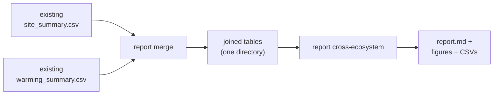
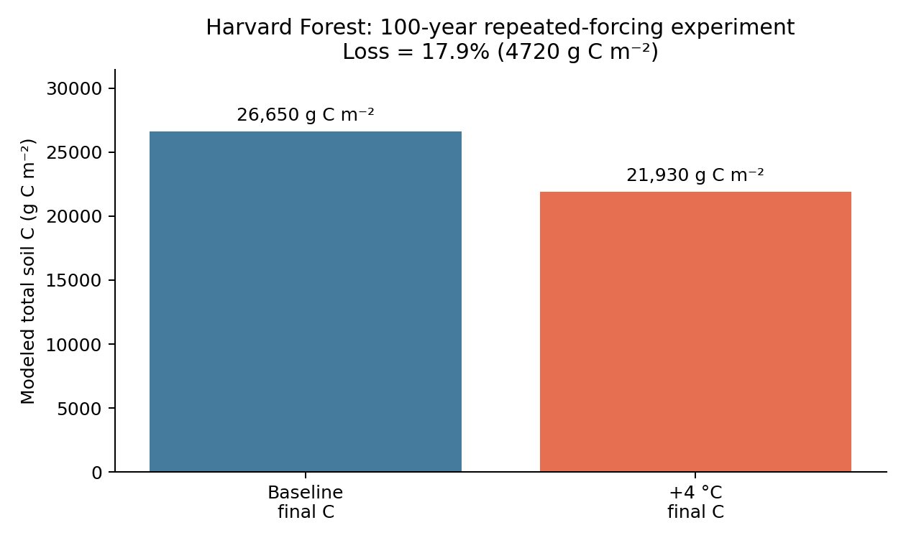

# `ecosys report`

`report` **combines existing result tables**. It does not re-run the model,
re-fit any site, or change uncertainties. Use it after `ecosys optimize`,
`ecosys warming`, and (optionally) `ecosys analyze network` have produced
summary CSVs you want to stitch together.

If you need the underlying calculation itself, use
[`ecosys analyze`](analyze.md) instead.



## `report merge`

Concatenates a new site set's summary rows onto the canonical network,
warming, and transit input tables, deduplicated by config.

```bash
ecosys report merge \
  --network-addition outputs/<set>/analyze/network/site_summary.csv \
  --warming-addition outputs/<set>/warming/network_warming_summary.csv \
  --name my_expanded_set
```

Always writes:

- `site_summary.csv` — joined network table (dedup by `config`, keeping the latest).
- `site_warming_summary.csv` — joined warming table.
- `optimized_transit_input.csv` — the transit-time input table with rows for the new sites appended.

`--sites <ISRaD names…>` restricts the appended rows before dedup, so you can
add just a subset of a new site set to the canonical base.

**Only merge compatible runs.** Configs must share pool structure, observation
choices, forcing, and warming scenario. A merged table does not make
heterogeneous runs comparable — dedup just picks a winner per `config`.

## `report cross-ecosystem`

Renders a Markdown report and figure bundle from an existing pair of network
and warming summaries.

```bash
ecosys report cross-ecosystem \
  --network-summary outputs/<set>/analyze/network/site_summary.csv \
  --warming-summary outputs/<set>/warming/network_warming_summary.csv \
  --name my_expanded_set
```

Writes:

- `report.md` — the human-readable summary (biome coverage, ecosystem-level tables).
- The cross-ecosystem figure PNG and its CSV backing tables.

This is descriptive synthesis. It carries forward whatever the input summaries
already contain; it does not add uncertainty or re-check comparability.

## Outputs and integration

Every completed command writes to `outputs/<name>/report/<subcommand>/` (or
below `--outdir`). Each run writes `manifest.json` and `logs/run.log`; the
manifest declares every generated artifact. On completion it prints the JSON
integration record with `output_dir`, `manifest`, and absolute paths for every
artifact.

## Harvard Forest example

```bash
ecosys report merge \
  --network-addition outputs/harvard_network/optimize/network_summary.csv \
  --warming-addition outputs/harvard_network/warming/network_warming_summary.csv \
  --name harvard_example
```

Build `harvard_network` as a site set containing Harvard Forest before merging.
Merging does not re-fit Harvard Forest or add uncertainty — it only prepares
compatible tables for a later descriptive synthesis with `report cross-ecosystem`.


